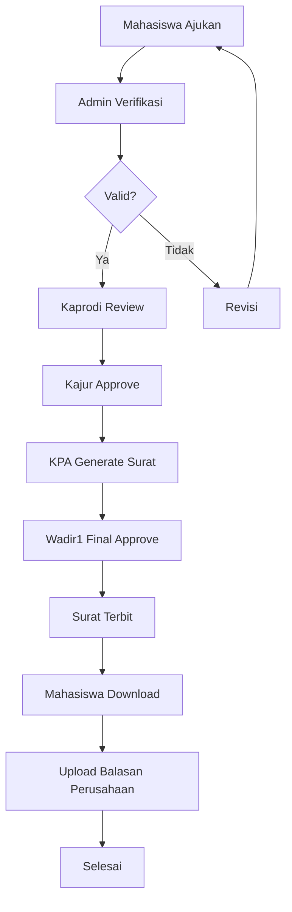

# SIMAMANG - Sistem Manajemen Magang POLSRI


> **Sistem Informasi Berbasis Web untuk Mendigitalisasi Proses Pengajuan, Validasi, Persetujuan, dan Dokumentasi Magang Mahasiswa**

[](https://laravel.com)
[](https://php.net)
[](https://www.mysql.com)
[](https://getbootstrap.com)

---

## 📋 Daftar Isi

- [Tentang SIMAMANG](#-tentang-simamang)
- [Fitur Utama](#-fitur-utama)
- [Teknologi](#-teknologi)
- [Persyaratan Sistem](#-persyaratan-sistem)
- [Instalasi](#-instalasi)
- [Konfigurasi](#-konfigurasi)
- [Penggunaan](#-penggunaan)
- [Struktur Database](#-struktur-database)
- [Workflow Sistem](#-workflow-sistem)
- [Chatbot MAMANG](#-chatbot-mamang)
- [API Documentation](#-api-documentation)
- [Testing](#-testing)
- [Deployment](#-deployment)
- [Troubleshooting](#-troubleshooting)
- [Kontribusi](#-kontribusi)
- [Lisensi](#-lisensi)
- [Tim Pengembang](#-tim-pengembang)

---

## 📖 Tentang SIMAMANG

**SIMAMANG** (Sistem Manajemen Magang) adalah aplikasi web berbasis Laravel yang dirancang untuk mendigitalisasi dan mengotomatisasi proses pengajuan magang mahasiswa di lingkungan Politeknik Negeri Sriwijaya (POLSRI).

### Latar Belakang

Proses pengajuan magang secara manual memiliki beberapa kendala:
- ❌ Bolak-balik dokumen fisik memakan waktu
- ❌ Sulit melacak status pengajuan
- ❌ Beban administratif tinggi bagi jurusan
- ❌ Arsip dokumen tidak terstruktur
- ❌ Proses persetujuan memerlukan waktu lama

### Solusi

SIMAMANG hadir untuk mengatasi masalah tersebut dengan:
- ✅ Proses pengajuan online 24/7
- ✅ Tracking status real-time
- ✅ Workflow persetujuan bertingkat otomatis
- ✅ E-signature digital (simulasi)
- ✅ Arsip dokumen terpusat dan terstruktur
- ✅ Notifikasi otomatis via email
- ✅ Chatbot asisten virtual (MAMANG)

---

## 🚀 Fitur Utama

### 1. **Pengajuan Magang Online**
- Form pengajuan lengkap dan intuitif
- Upload dokumen (Proposal & Draft Surat)
- Validasi data otomatis
- Google Maps integration untuk lokasi perusahaan

### 2. **Workflow Persetujuan Bertingkat**
```
Mahasiswa → Admin Jurusan → Kaprodi → Kajur → KPA → Wadir 1 → Surat Terbit
```
- Setiap level approval terintegrasi
- Notifikasi email otomatis
- Deadline reminder
- Approval history lengkap

### 3. **E-Signature Digital**
- QR Code verification
- Timestamp approval
- Data approver terekam
- Verifikasi keaslian dokumen

### 4. **Generate PDF Surat Pengantar**
- Template surat resmi POLSRI
- Nomor surat otomatis
- QR Code embedded
- Kop surat digital

### 5. **Chatbot MAMANG** 🤖
- Rule-based chatbot
- Cek status pengajuan
- Panduan step-by-step
- FAQ interaktif
- Quick action buttons

### 6. **Dashboard Multi-Role**
- Dashboard khusus per role
- Real-time statistics
- Activity timeline
- Weather widget
- Real-time clock (WIB)

### 7. **Document Management**
- Upload multiple documents
- Preview dokumen online
- Download history
- Secure storage

### 8. **Activity Logging**
- Audit trail lengkap
- IP address tracking
- User agent recording
- Action timestamp

### 9. **Reporting & Analytics**
- Export data (PDF/Excel)
- Grafik statistik
- Performance metrics
- Monthly reports

---

## 💻 Teknologi

### Backend
- **Framework**: Laravel 12.x
- **Language**: PHP 8.2+
- **Database**: MySQL 8.0+
- **ORM**: Eloquent

### Frontend
- **Template Engine**: Blade
- **CSS Framework**: Bootstrap 5.3
- **Icons**: Bootstrap Icons 1.11
- **JavaScript**: Vanilla JS (ES6+)

### Libraries & Packages
- **barryvdh/laravel-dompdf** - PDF generation
- **simplesoftwareio/simple-qrcode** - QR Code generator
- **Laravel Sanctum** - API authentication (optional)
- **Laravel Mail** - Email notifications

### Tools & Services
- **Composer** - Dependency management
- **NPM/Yarn** - Asset compilation
- **Git** - Version control
- **Google Maps API** - Location services (optional)
- **OpenWeather API** - Weather widget (optional)

---

## 📋 Persyaratan Sistem

### Minimum Requirements

#### Server
- **OS**: Linux (Ubuntu 20.04+), macOS, atau Windows 10+
- **Web Server**: Apache 2.4+ atau Nginx 1.18+
- **PHP**: 8.2 atau lebih tinggi
- **Database**: MySQL 8.0+ atau MariaDB 10.5+
- **Composer**: 2.5+

#### PHP Extensions (Required)
```bash
- php-gd           # Untuk QR Code & Image processing
- php-mbstring     # String handling
- php-xml          # XML processing
- php-curl         # HTTP requests
- php-zip          # Archive handling
- php-pdo          # Database connection
- php-mysql        # MySQL driver
```

#### Optional Extensions
```bash
- php-imagick      # Advanced image processing (alternative untuk GD)
- php-redis        # Cache & queue (untuk production)
```

### Recommended Specs (Production)

- **CPU**: 2 cores or more
- **RAM**: 4GB minimum, 8GB recommended
- **Storage**: 20GB SSD
- **Bandwidth**: 100Mbps

---

## 📦 Instalasi

### Quick Start (Development)

```bash
# 1. Clone Repository
git clone tps://github.com/JustRio24/SIMAMANG_v2
cd simamang

# 2. Install Dependencies
composer install

# 3. Environment Setup
cp .env.example .env
php artisan key:generate

# 4. Configure Database (.env)
DB_DATABASE=simamang
DB_USERNAME=root
DB_PASSWORD=your_password

# 5. Create Database
mysql -u root -p
CREATE DATABASE simamang CHARACTER SET utf8mb4 COLLATE utf8mb4_unicode_ci;
EXIT;

# 6. Run Migrations & Seeder
php artisan migrate
php artisan db:seed

# 7. Create Storage Link
php artisan storage:link

# 8. Create Required Directories
mkdir -p storage/app/public/documents
mkdir -p storage/app/public/signatures

# 9. Start Development Server
php artisan serve
```

Akses aplikasi di: **http://localhost:8000**

### Install PHP Extensions

#### Ubuntu/Debian
```bash
sudo apt-get update
sudo apt-get install php8.2-gd php8.2-mbstring php8.2-xml php8.2-curl php8.2-zip php8.2-mysql
sudo systemctl restart apache2
```

#### macOS (Homebrew)
```bash
brew install php@8.2
pecl install imagick
```

#### Windows
1. Download PHP extensions dari https://windows.php.net/downloads/pecl/
2. Extract ke folder `ext/` di PHP directory
3. Edit `php.ini` dan aktifkan extensions
4. Restart web server

### Setup Logo

**PENTING!** Simpan logo SIMAMANG ke:
```bash
public/images/logo-simamang.png
```

Format: PNG dengan background transparan, ukuran recommended 200x200px.

### Import Dummy Data (Optional)

Untuk testing dengan data demo:
```bash
mysql -u root -p simamang < database/simamang_dummy_data.sql
```

---

## ⚙️ Konfigurasi

### Environment Variables (.env)

```env
# Application
APP_NAME=SIMAMANG
APP_ENV=local
APP_DEBUG=true
APP_TIMEZONE=Asia/Jakarta
APP_LOCALE=id
APP_URL=http://localhost

# Database
DB_CONNECTION=mysql
DB_HOST=127.0.0.1
DB_PORT=3306
DB_DATABASE=simamang
DB_USERNAME=root
DB_PASSWORD=

# Mail Configuration (Optional)
MAIL_MAILER=smtp
MAIL_HOST=smtp.gmail.com
MAIL_PORT=587
MAIL_USERNAME=your-email@gmail.com
MAIL_PASSWORD=your-app-password
MAIL_ENCRYPTION=tls
MAIL_FROM_ADDRESS=noreply@simamang.polsri.ac.id
MAIL_FROM_NAME="${APP_NAME}"

# API Keys (Optional)
OPENWEATHER_API_KEY=your_api_key
GOOGLE_MAPS_API_KEY=your_api_key
```

### File Permissions (Linux/Mac)

```bash
sudo chown -R $USER:www-data storage bootstrap/cache
sudo chmod -R 775 storage bootstrap/cache
```

### Web Server Configuration

#### Apache (.htaccess)
```apache
<IfModule mod_rewrite.c>
    RewriteEngine On
    RewriteRule ^(.*)$ public/$1 [L]
</IfModule>
```

#### Nginx
```nginx
server {
    listen 80;
    server_name simamang.local;
    root /var/www/simamang/public;

    add_header X-Frame-Options "SAMEORIGIN";
    add_header X-Content-Type-Options "nosniff";

    index index.php;

    charset utf-8;

    location / {
        try_files $uri $uri/ /index.php?$query_string;
    }

    location ~ \.php$ {
        fastcgi_pass unix:/var/run/php/php8.2-fpm.sock;
        fastcgi_param SCRIPT_FILENAME $realpath_root$fastcgi_script_name;
        include fastcgi_params;
    }

    location ~ /\.(?!well-known).* {
        deny all;
    }
}
```

---

## 👥 Penggunaan

### Login Credentials (Default)

#### Pejabat
| Role | Email | Password |
|------|-------|----------|
| Admin Jurusan | admin.ts@polsri.ac.id | password123 |
| Ketua Prodi (Kaprodi) | kaprodi@polsri.ac.id | password123 |
| Ketua Jurusan (Kajur) | kajur@polsri.ac.id | password123 |
| KPA | kpa@polsri.ac.id | password123 |
| Wakil Direktur 1 | wadir1@polsri.ac.id | password123 |

#### Mahasiswa
| Nama | Email | Password |
|------|-------|----------|
| Mahasiswa 1 | mahasiswa1@mhs.polsri.ac.id | password123 |
| Mahasiswa 2 | mahasiswa2@mhs.polsri.ac.id | password123 |
| Mahasiswa 3 | mahasiswa3@mhs.polsri.ac.id | password123 |
| Mahasiswa 4 | mahasiswa4@mhs.polsri.ac.id | password123 |
| Mahasiswa 5 | mahasiswa5@mhs.polsri.ac.id | password123 |

### User Guide

#### Untuk Mahasiswa

1. **Registrasi/Login**
   - Daftar akun baru dengan email institusi
   - Login dengan credentials yang sudah dibuat

2. **Membuat Pengajuan Magang**
   - Klik "Ajukan Magang"
   - Isi form data perusahaan
   - Upload proposal (PDF, max 5MB)
   - Upload draft surat pengantar (PDF/DOC, max 5MB)
   - Submit pengajuan

3. **Tracking Status**
   - Cek dashboard untuk melihat status real-time
   - Lihat timeline approval
   - Download surat jika sudah terbit

4. **Chat dengan MAMANG**
   - Tanyakan status pengajuan
   - Minta panduan proses
   - Akses FAQ

#### Untuk Admin Jurusan

1. **Verifikasi Pengajuan**
   - Lihat daftar pengajuan baru
   - Review dokumen
   - Verifikasi atau minta revisi

2. **Monitoring**
   - Dashboard statistik
   - Track semua pengajuan
   - Generate reports

#### Untuk Pejabat (Kaprodi, Kajur, KPA, Wadir1)

1. **Approval Pengajuan**
   - Lihat pengajuan yang perlu approval
   - Review detail pengajuan
   - Approve atau reject dengan catatan

2. **Generate Surat (KPA)**
   - Generate surat pengantar resmi
   - Download PDF dengan QR Code
   - Forward ke Wadir 1

---

## 🗄️ Struktur Database

### Entity Relationship Diagram

```
users (1) ─────< (N) internship_applications
                      │
                      ├─< (N) documents
                      ├─< (N) approvals
                      └─< (N) activity_logs

users (1) ─────< (N) chat_messages
users (1) ─────< (N) activity_logs
```

### Tabel Utama

#### 1. users
```sql
- id (PK)
- name
- email (unique)
- nim (unique, nullable)
- role (enum: mahasiswa, admin_jurusan, kaprodi, kajur, kpa, wadir1)
- jurusan
- prodi
- phone
- password
- timestamps
```

#### 2. internship_applications
```sql
- id (PK)
- student_id (FK → users.id)
- company_name
- company_address
- company_city
- company_phone
- company_email
- latitude, longitude
- start_date, end_date
- duration_months
- internship_description
- status (enum)
- revision_note
- letter_number
- timestamps, soft_deletes
```

#### 3. documents
```sql
- id (PK)
- internship_application_id (FK)
- type (enum: proposal, surat_pengantar, surat_resmi, balasan)
- file_name, file_path, file_type, file_size
- uploaded_by (FK → users.id)
- description
- timestamps
```

#### 4. approvals
```sql
- id (PK)
- internship_application_id (FK)
- role (enum)
- approved_by (FK → users.id)
- action (enum: approve, reject, revise)
- note
- signature_path
- qr_code_path
- approved_at
- timestamps
```

#### 5. activity_logs
```sql
- id (PK)
- user_id (FK)
- internship_application_id (FK, nullable)
- action
- description
- ip_address
- user_agent
- timestamps
```

#### 6. chat_messages
```sql
- id (PK)
- user_id (FK)
- message
- response
- intent
- timestamps
```

#### 7. faq
```sql
- id (PK)
- question
- answer
- category
- view_count
- is_active
- timestamps
```

---

## 🔄 Workflow Sistem

### Alur Persetujuan Lengkap



### Status Pengajuan

| Status | Deskripsi | Next Action |
|--------|-----------|-------------|
| `diajukan` | Pengajuan baru dibuat | Admin verifikasi |
| `revisi` | Perlu perbaikan | Mahasiswa update |
| `diverifikasi_jurusan` | Lolos verifikasi admin | Kaprodi review |
| `disetujui_kaprodi` | Kaprodi approve | Kajur approve |
| `disetujui_akademik` | Kajur approve | KPA generate surat |
| `diproses_kpa` | KPA sedang proses | Wadir1 approve |
| `disetujui_wadir1` | Wadir1 approve | Sistem terbitkan surat |
| `surat_terbit` | Surat resmi keluar | Mahasiswa download |
| `balasan_diterima` | Balasan perusahaan masuk | Admin close |
| `selesai` | Proses complete | - |
| `ditolak` | Pengajuan ditolak | - |

### Estimasi Waktu

| Tahap | Estimasi |
|-------|----------|
| Verifikasi Admin | 1-2 hari kerja |
| Persetujuan Kaprodi | 1-2 hari kerja |
| Persetujuan Kajur | 2-3 hari kerja |
| Proses KPA | 1-2 hari kerja |
| Approval Wadir 1 | 1-2 hari kerja |
| **TOTAL** | **6-11 hari kerja** |

---

## 🤖 Chatbot MAMANG

### Tentang MAMANG

**MAMANG** (Asisten Virtual SIMAMANG) adalah chatbot rule-based yang dirancang untuk membantu pengguna dalam proses magang.

### Fitur MAMANG

✅ **Rule-based System** - Bukan AI generatif, menggunakan keyword detection
✅ **Data-driven** - Hanya mengambil data dari database sistem
✅ **Intent Detection** - Mendeteksi maksud pertanyaan user
✅ **FAQ Integration** - Terintegrasi dengan database FAQ
✅ **Quick Actions** - Button shortcuts untuk pertanyaan umum

### Keyword Detection

```php
'status' => ['status', 'pengajuan', 'dimana', 'posisi', 'tahap']
'cara' => ['cara', 'bagaimana', 'prosedur', 'langkah']
'dokumen' => ['dokumen', 'file', 'persyaratan', 'syarat']
'timeline' => ['lama', 'berapa', 'waktu', 'durasi']
'bantuan' => ['bantuan', 'help', 'tolong', 'bingung']
```

### Contoh Interaksi

**User:** "Status magang saya?"
**MAMANG:** "Pengajuan magang Anda ke PT WIKA saat ini berada pada tahap Disetujui Akademik (diupdate 2 hari lalu). Pengajuan Anda telah disetujui akademik dan sedang diproses oleh KPA untuk pembuatan surat pengantar."

**User:** "Cara mengajukan magang?"
**MAMANG:** "Alur Proses Magang di SIMAMANG: 1. Mahasiswa mengajukan, 2. Admin Jurusan memverifikasi, 3. Kaprodi memberikan persetujuan, 4. Kajur menyetujui, 5. KPA generate surat pengantar, 6. Wadir 1 approval final..."

### Custom Responses

MAMANG dapat di-customize dengan menambahkan FAQ baru di database:

```sql
INSERT INTO faq (question, answer, category) VALUES
('Pertanyaan baru?', 'Jawaban lengkap...', 'Kategori');
```

---

## 📡 API Documentation

### Authentication

SIMAMANG menggunakan Laravel Sanctum untuk API authentication (optional untuk integrasi eksternal).

**Base URL:** `http://localhost:8000/api`

### Endpoints

#### Authentication
```http
POST /api/login
POST /api/logout
POST /api/register
```

#### Internships
```http
GET    /api/internships          # List all
GET    /api/internships/{id}     # Show detail
POST   /api/internships          # Create new
PUT    /api/internships/{id}     # Update
DELETE /api/internships/{id}     # Delete
```

#### Approvals
```http
POST /api/internships/{id}/approve
POST /api/internships/{id}/reject
```

#### Example Request

```bash
curl -X POST http://localhost:8000/api/login \
  -H "Content-Type: application/json" \
  -d '{
    "email": "mahasiswa1@mhs.polsri.ac.id",
    "password": "password123"
  }'
```

---

## 🧪 Testing

### Run Tests

```bash
# Run all tests
php artisan test

# Run specific test
php artisan test --filter InternshipTest

# Run with coverage
php artisan test --coverage
```

### Test Structure

```
tests/
├── Feature/
│   ├── AuthTest.php
│   ├── InternshipTest.php
│   ├── ApprovalTest.php
│   └── ChatbotTest.php
└── Unit/
    ├── UserModelTest.php
    └── ApplicationModelTest.php
```

### Example Test

```php
public function test_mahasiswa_can_create_internship()
{
    $user = User::factory()->create(['role' => 'mahasiswa']);
    
    $response = $this->actingAs($user)->post('/internships', [
        'company_name' => 'PT Test',
        'company_address' => 'Jakarta',
        // ... other fields
    ]);
    
    $response->assertStatus(302);
    $this->assertDatabaseHas('internship_applications', [
        'company_name' => 'PT Test'
    ]);
}
```

---

## 🚀 Deployment

### Production Checklist

- [ ] Update `.env` untuk production
- [ ] Set `APP_ENV=production`
- [ ] Set `APP_DEBUG=false`
- [ ] Configure proper database credentials
- [ ] Setup SSL certificate
- [ ] Configure mail server
- [ ] Setup backup strategy
- [ ] Configure queue worker
- [ ] Setup monitoring tools

### Optimization

```bash
# Install production dependencies
composer install --optimize-autoloader --no-dev

# Cache configuration
php artisan config:cache
php artisan route:cache
php artisan view:cache

# Optimize autoloader
composer dump-autoload --optimize
```

### Server Requirements

**Recommended VPS Specs:**
- 2 vCPU cores
- 4GB RAM
- 40GB SSD
- Ubuntu 22.04 LTS

### Deployment Steps

1. **Prepare Server**
```bash
sudo apt update
sudo apt install nginx mysql-server php8.2-fpm php8.2-mysql php8.2-gd
```

2. **Clone & Setup**
```bash
cd /var/www
git clone your-repo simamang
cd simamang
composer install --no-dev
cp .env.production .env
php artisan key:generate
```

3. **Database**
```bash
mysql -u root -p
CREATE DATABASE simamang;
EXIT;
php artisan migrate --force
```

4. **Permissions**
```bash
sudo chown -R www-data:www-data /var/www/simamang
sudo chmod -R 755 /var/www/simamang/storage
```

5. **Nginx Config**
```bash
sudo nano /etc/nginx/sites-available/simamang
sudo ln -s /etc/nginx/sites-available/simamang /etc/nginx/sites-enabled/
sudo nginx -t
sudo systemctl restart nginx
```

6. **SSL with Let's Encrypt**
```bash
sudo apt install certbot python3-certbot-nginx
sudo certbot --nginx -d simamang.polsri.ac.id
```

---

## 🔧 Troubleshooting

### Common Issues

#### 1. QR Code Error
**Error:** `BaconQrCode\Exception\RuntimeException`

**Solution:**
```bash
sudo apt-get install php-gd
sudo systemctl restart apache2
php artisan config:clear
```

#### 2. Permission Denied
**Error:** `Permission denied` on storage

**Solution:**
```bash
sudo chown -R www-data:www-data storage bootstrap/cache
sudo chmod -R 775 storage bootstrap/cache
```

#### 3. Logo Not Showing
**Error:** Logo tidak muncul di navbar

**Solution:**
```bash
# Pastikan logo ada di public/images/
ls -la public/images/logo-simamang.png

# Clear cache
php artisan view:clear
php artisan cache:clear
```

#### 4. Database Connection Error
**Error:** `SQLSTATE[HY000] [2002]`

**Solution:**
- Cek credentials di `.env`
- Pastikan MySQL running: `sudo systemctl status mysql`
- Test connection: `mysql -u root -p`

#### 5. 500 Internal Server Error
**Solution:**
```bash
# Check logs
tail -f storage/logs/laravel.log

# Clear all cache
php artisan optimize:clear

# Check permissions
ls -la storage/
```

### Debug Mode

Enable debug untuk development:
```env
APP_DEBUG=true
APP_ENV=local
```

**⚠️ JANGAN aktifkan di production!**

---

## 🤝 Kontribusi

Kami menerima kontribusi dari siapa saja! Berikut panduan untuk berkontribusi:

### How to Contribute

1. **Fork Repository**
```bash
git clone https://github.com/your-username/simamang.git
```

2. **Create Branch**
```bash
git checkout -b feature/amazing-feature
```

3. **Commit Changes**
```bash
git commit -m "Add amazing feature"
```

4. **Push to Branch**
```bash
git push origin feature/amazing-feature
```

5. **Open Pull Request**
- Buat PR dengan deskripsi lengkap
- Sertakan screenshot jika ada perubahan UI
- Pastikan semua test passed

### Coding Standards

- Follow PSR-12 coding style
- Write meaningful commit messages
- Add comments untuk logic kompleks
- Update documentation jika perlu

### Git Workflow

```
main (production-ready)
  ↓
develop (development branch)
  ↓
feature/xxx (your feature)
```

---

## 📄 Lisensi

Sistem ini dikembangkan untuk keperluan akademik dan internal POLSRI.

**Copyright © 2025 Politeknik Negeri Sriwijaya**

Untuk penggunaan di luar POLSRI, silakan hubungi:
- **Email:** info@polsri.ac.id
- **Website:** https://polsri.ac.id

---

## 👨‍💻 Tim Pengembang

### Project Lead
- **RIO** - Lead Developer
  - Email: justrio24@gmail.com
  - GitHub: JustRio24(https://github.com/JustRio24)
  - Fullstack Developer & UI/UX Designer

### Special Thanks
- **Politeknik Negeri Sriwijaya** - Support & Resources
- **Jurusan Manajemen Informatika** - Testing & Feedback
- **Laravel Community** - Framework & Documentation

---

## 📞 Dukungan & Kontak

### Technical Support
- **Email:** support.simamang@polsri.ac.id
- **Phone:** +62 711 353414

### Bug Report
Laporkan bug melalui:
- GitHub Issues: [Create Issue](https://github.com/justrio24/simamang_v2/issues)
- Email: bugs@simamang.polsri.ac.id

### Feature Request
Kirim request fitur baru ke: features@simamang.polsri.ac.id

---

## 📚 Referensi

### Documentation
- [Laravel Documentation](https://laravel.com/docs)
- [Bootstrap Documentation](https://getbootstrap.com/docs)
- [DomPDF Documentation](https://github.com/barryvdh/laravel-dompdf)
- [Simple QR Code](https://www.simplesoftware.io/docs/simple-qrcode)

### Related Projects
- [Laravel Boilerplate](https://github.com/rappasoft/laravel-boilerplate)
- [Laravel Admin Panel](https://github.com/z-song/laravel-admin)

---

## 📝 Changelog

### Version 1.0.0 (2025-01-17)
- ✨ Initial release
- ✨ Complete workflow approval system
- ✨ E-signature with QR Code
- ✨ Chatbot MAMANG
- ✨ Multi-role dashboard
- ✨ Real-time clock & weather widget
- ✨ PDF generation
- ✨ Activity logging

### Upcoming Features
- 🔄 Email notifications
- 🔄 Push notifications
- 🔄 Mobile app (React Native)
- 🔄 Advanced analytics
- 🔄 Integration with SIAKAD

---

## ⭐ Star History

Jika SIMAMANG membantu Anda, berikan ⭐ di GitHub!

[](https://star-history.com/#your-username/simamang&Date)

---

## 🙏 Acknowledgments

Terima kasih kepada:
- Allah SWT atas segala kemudahan
- Keluarga atas dukungan moral
- Dosen pembimbing atas bimbingan
- Teman-teman atas kolaborasi
- POLSRI atas fasilitas
- Open source community

---